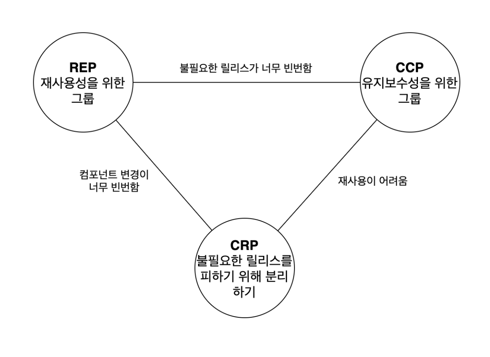

# Component

- 컴포넌트는 배포 단위다.
- 컴포넌트는 시스템의 구성 요소로 배포할 수 있는 가장 작은 단위다.
    
    자바 : jar

    닷넷 : DLL

- 여러 컴포넌트를 서로 링크하여 실행 가능한 단일 파일로 생성할 수 있다.
    
    예) war, exe

- 잘 설계된 컴포넌트라면 반드시 독립적으로 배포/개발 가능한 능력을 갖춰야 한다.

### REP : 재사용/릴리스 등가 원칙
> Reuse/Release Equivalence Principle

- 재사용 단위는 릴리스 단위와 같다.

- 단일 컴포넌트는 응집성 높은 클래스와 모듈들로 구성되어야 함을 뜻한다.

- 컴포넌트를 구성하는 모든 모듈은 서로 공유하는 중요한 테마나 목적이 있어야 한다. 

    -> 함께 릴리스할 수 있어야 한다.

### CCP : 공통 폐쇄 원칙
> Common Closure Principle

- 동일한 이유로 동일한 시점에 변경되는 클래스를 같은 컴포넌트로 묶어라. 서로 다른 시점에 다른 이유로 변경되는 클래스는 다른 컴포넌트로 분리하라.

- 단일 책임 원칙(SRP)을 컴포넌트 관점에서 다시 쓴 것이다.

    -> 단일 컴포넌트는 변경의 이유가 여러 개 있어서는 안 된다.

- 동일한 유형의 변경에 대해 닫혀 있는 클래스들을 하나의 컴포넌트로 묶음으로써 OCP에서 얻은 교훈을 확대 적용한다.

### CRP : 공통 재사용 원칙
> Common Reuse Principle

- 컴포넌트 사용자들을 필요하지 않는 것에 의존하게 강요하지 말라.

- 재사용되는 경향이 있는 클래스와 모듈들을 같은 컴포넌트에 포함해야 한다.

- 강하게 결합되지 않은 클래스들을 동일한 컴포넌트에 위치시켜서는 안 된다.

- 인터페이스 분리 원칙(ISP)의 포괄적인 버전이다.

    ISP : 사용하지 않은 메서드가 있는 클래스에 의존하지 말라.

    CRP : 사용하지 않는 클래스를 가진 컴포넌트에 의존하지 말라.

### 컴포넌트 응집도에 대한 균형 다이어그램

- 세 원칙은 서로 상충된다.

- REP와 CCP는 포함 원칙이다. -> 컴포넌트를 더욱 크게 만든다.

- CRP는 배제 원칙이다. -> 컴포넌트를 더욱 작게 만든다.

- 각 변은 반대쪽 꼭지점에 있는 원칙을 포기했을 때 감수해야 할 비용을 나타낸다.

    예) REP와 CRP에만 중점을 두면, 사소한 변경이 생겼을 때 너무 많은 컴포넌트에 영향을 미친다.

- 프로젝트 초기에는 CCP가 REP보다 훨씬 더 중요한데, 개발 가능성이 재사용성보다 더욱 중요하기 때문이다.

- 일반적으로 프로젝트는 삼격형의 오른쪽에서 시작하는 편이며, 점차 왼쪽으로 이동해 간다. 즉, 컴포넌트 구조는 시간과 성숙도에 따라 변한다는 뜻이다.

### ADP : 의존성 비순환 원칙
> Acyclic Dependencies Principle

- 컴포넌트 의존성 그래프에 순환이 있어서는 안 된다.

- 개발 환경을 릴리스 가능한 컴포넌트 단위로 분리하는 것이다.

    각 팀은 특정 컴포넌트가 새롭게 릴리스되면 자신의 컴포넌트를 해당 컴포넌트에 맞게 수정할 시기를 스스로 결정할 수 있다.

- 순환을 끊는 방법

    1. 의존성 역전 원칙 사용하기
    2. 의존하는 새로운 컴포넌트 만들기

### SDP : 안정된 의존성 원칙
> Stable Dependencies Principle

- 변경이 쉽지 않은 컴포넌트가 변동이 예상되는 컴포넌트에 의존하게 만들어서는 절대로 안 된다.

- 안정된 컴포넌트란?

    컴포넌트 안쪽으로 들어오는 의존성이 많아지면 상당히 안정적이라고 볼 수 있는데, 사소한 변경이라도 의존하는 모든 컴포넌트를 만족시키면서 변경하려면 상당한 노력이 들기 때문이다.
    책임적이며 다른 컴포넌트에 의존적이지 않을 확률이 높기 때문에 독립적일 가능성이 높다. -> 외부 요인에 의해 변경가능성이 낮다.

### SAP : 안정된 추상화 원칙
> Stable Abstractions Principle

- 고수준 정책은 자주 변경되서는 안되는데, 해당 정책을 안정된 컴포넌트에 위치시키면 그 정책을 포함하는 소스 코드는 수정하기 어렵기 때문이다. -> 시스템 전체의 아키텍처가 유연성을 잃는다.

- 안정된 상태이면서 변경에 충분히 대응하는 방법 = OCP

- 안정된 컴포넌트는 추상 컴포넌트여야 하며, 이를 통해 안정성이 컴포넌트를 확장하는 일을 방해해서는 안 된다.

- 불안정한 컴포넌트는 반드시 구체 컴포넌트여야 한다. -> 불안정하므로 내부의 구체적인 코드를 쉽게 변경할 수 있어야 하기 때문이다.

### 용어 정리
- 모듈

    - 가장 상위에 위치한 구현의 단위

    - 비슷하거나 연관성 있는 것들로 이루어진 메소드나 클래스의 집합

    - 코드의 재사용 및 유지보수를 쉽게 하여줌

- 컴포넌트

    - 런타임 개체를 참조하는 단위

    - 독립적으로 개발하여도 모듈간의 호환이 되지 않는 경우가 있습니다. 그렇다면 소프트웨어의 재사용이 어려워지게 됩니다. 그런 문제를 해결하기 위한 방법이 컴포넌트이고 컴포넌트는 소프트웨어의 재사용을 위한 일종의 개발 방법

모듈과 컴포넌트 둘다 하나의 기능을 가지고 소프트웨어의 재사용하기 위해 사용합니다. 의미가 비슷하지만 둘의 차이점이 있습니다. 모듈은 구조의 최소 단위, 정적인 구조를 가지고 컴포넌트는 런타임에 독립적으로 배포되고 실행 되는 단위입니다.

예) 1개의 서버에게 서비스를 제공받는 100개의 클라이언트가 존재한다고 가정하자.
위에 설명한 내용으로 모듈, 컴포넌트의 개수를 각각 세어보면 서버가 구현된 모듈 1개, 클라이언트가 구현된 모듈 1개이므로 이 시스템 인프라의 총 모듈 개수는 2개이다.
컴포넌트의 경우 실제 동작하고 있는 개체를 의미하므로 총 101개가 된다.