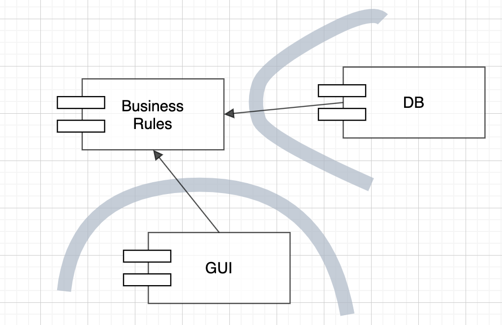

# 아키텍처

- 소프트웨어 시스템의 아키텍처란 시스템을 구축했던 사람들이 만들어낸 시스템의 형태다.
- 모양은 시스템을 컴포넌트로 분할하는 방법, 분할된 컴포넌트를 배치하는 방법, 컴포넌트가 서로 의사소통하는 방법에 따라 정해진다.
- 형태는 아키텍처 안에 담긴 소프트웨어 시스템이 쉽게 개발, 배포, 운영, 유지보수되도록 만들어진다.
- 아키텍처의 주된 목적은 시스템의 생명주기를 지원하는 것이다.
  좋은 아키텍처는 시스템을 쉽게 이해하고, 쉽게 개발하며, 쉽게 유지보수하고, 또 쉽게 배포하게 해준다.이는 시스템의 수명과 관련된 비용은 최소화하고, 프로그래머의 생산성은 최대화하는 데 있다.

### 선택사항 열어 두기

- 소프트웨어는 행위적 가치와 구조적 가치를 지닌다.
- 이 중에서 두 번째 가치가 더 중요한데, 소프트웨어를 부드럽게 만드는 것은 바로 이 구조적 가치이기 때문이다.
- 소프트웨어를 만든 이유는 기계의 행위를 빠르고 쉽게 변경하는 방법이 필요했기 때문이다.
  하지만 이러한 유연성은 시스템의 형태, 컴포넌트의 배치 방식, 컴포넌트가 상호 연결되는 방식에 상당히 크게 의존한다.
- 소프트웨어를 부드럽게 유지하는 방법은 선택사항을 가능한 한 많이, 그리고 가능한 한 오랫동안 열어 두는 것이다.
  그렇다면 열어 둬야 할 선택사항이란 무엇일까? 그것은 바로 **중요치 않은 세부사항**이다.
- 모든 소프트웨어 시스템은 주요한 두 가지 구성요소로 분해할 수 있다. 바로 **정책**과 **세부사항**이다.
- **정책** 요소는 모든 업무 규칙과 업무 절차를 구체화한다.
  정책이란 시스템의 진정한 가치가 살아 있는 곳이다.
- **세부사항**은 사람, 외부 시스템, 프로그래머가 정책과 소통할 때 필요한 요소지만, 정책이 가진 행위에는 조금도 영향을 미치지 않는다.
  이러한 세부사항에는 입출력 장치, 데이터베이스, 웹 시스템, 서버, 프레임워크, 통신 프로토콜 등이 있다.
- 아키텍트의 목표는 시스템에서 정책을 가장 핵심적인 요소로 식별하고, 동시에 세부사항은 정책에 무관하게 만들 수 있는 형태의 시스템을 구축하는데 있다.

# 독립성

- 좋은 아키텍처는 다음을 지원해야 한다.
  - 시스템의 유스케이스
  - 시스템의 운영
  - 시스템의 개발
  - 시스템의 배포

### 유스케이스

- 시스템의 의도를 지원해야 한다. -> 아키텍처 수준에서 알아볼 수 있게 만드는 것이다.
- 좋은 아키텍처를 갖춘다면, 유스케이스는 시스템 구조 자체에서 한눈에 드러날 것이며 자신의 기능을 분명하게 설명하는 이름을 가질 것이다.

### 운영

- 시스템의 운영 지원 관점에서 볼 때 아키텍처는 더 실질적이며 덜 피상적인 역할을 맡는다.
- 시스템이 초당 100,000명의 고객을 처리해야 한다면, 아키텍처는 이 요구와 관련된 각 유스케이스에 걸맞은 처리량과 응답시간을 보장해야 한다.
- 만약 시스템에서 수 밀리초 안에 3차원의 빅데이터 테이블에 질의해야한다면, 반드시 이러한 운영 작업을 허용할 수 있는 형태로 아키텍처를 구조화해야 한다.
- 아키텍처에서 각 컴포넌트를 적절히 격리하여 유지하고 컴포넌트 간 통신 방식을 특정 형태로 제한하지 않는다면,
  시간이 지나 운영에 필요한 요구사항이 바뀌더라도 구성된 기술 스펙트럼 사이를 전환하는 일이 훨씬 쉬워질 것이다.

### 개발

- 콘웨이의 법칙 : 시스템을 설계하는 조직이라면 어디든지 그 조직의 의사소통 구조와 동일한 구조의 설계를 만들어 낼 것이다.
- 각 팀이 독립적으로 행동하기 편한 아키텍처를 반드시 확보하여 개발하는 동안 팀들이 서로를 방해하지 않도록 해야 한다.

### 배포

- 목표는 '즉각적인 배포'다.
- 좋은 아키텍처는 수십 개의 작은 설정 스크립트나 속성 파일을 약간씩 수정하는 방식을 사용하지 않는다.
- 좋은 아키텍처라면 시스템이 빌드된 후 즉각 배포할 수 있도록 지원해야 한다.

### 선택사항 열어 두기

- 좋은 아키텍처는 컴포넌트 구조와 관련된 이 관심사들 사이에서 균형을 맞추고, 각 관심사 모두를 만족시킨다. 말은 쉽다. 그렇지 않은가?
- 현실에서는 이러한 균형을 잡기가 매우 어렵다.
- 우리가 도달하려는 목표는 뚜렷하지 않을 뿐만 아니라 시시각각 변한다.
  - 모든 유스케이스를 알 수 없음
  - 운영하는 데 따르는 제약사항, 팀 구조, 배포 요구사항도 알지 못함
  - 위 사항들을 알고 있더라도, 시스템이 생명주기의 단계를 하나씩 거쳐감에 따라 이 사항들도 반드시 변해감
- 그러나 이런 변화 속에서도 사라지지 않는 것이 있다.
- 몇몇 아키텍처 원칙은 구현하는 비용이 비교적 비싸지 않으며, 관심사들 사이에서 균형을 잡는데 도움이 된다.
  이들 원칙은 시스템을 격리된 컴포넌트 단위로 분해할 때 도움이 되며, 이를 통해 선택사항을 가능한 한 많이, 그리고 가능한 한 오랫동안 열어 둘 수 있게 해준다.
- 좋은 아키텍처는 선택사항을 열어 둠으로써, 향후 시스템에 변경이 필요할 때 어떤 방향으로든 쉽게 변경할 수 있도록 한다.

### 계층 결합 분리

- 아키텍트는 필요한 모든 유스케이스를 지원할 수 있는 시스템 구조를 원하지만, 유스케이스 전부를 알지는 못한다.
- 하지만 아키텍트는 시스템의 기본적인 의도는 분명히 알고 있다. ex) 장바구니 시스템
- 따라서 아키텍트는 단일 책임 원칙(SRP)과 공통 폐쇄 원칙(OCP)을 적용하여,
  그 의도의 맥락에 따라서 다른 이유로 변경되는 것들은 분리하고, 동일한 이유로 변경되는 것들을 묶는다.
- 서로 다른 이유로 변경되는 것은 무엇일까?
  - 사용자 인터페이스(UI)가 변경되는 이유는 업무 규칙과는 아무런 관련이 없다.
  - 업무 규칙은 그 자체가 애플리케이션과 밀접한 관련이 있거나, 혹은 더 범용적일 수 있다.
  - 예를 들어 입력 필드 유효성 검사는 **애플리케이션 자체와 밀접하게 관련된 업무 규칙**이다.
  - 반대로 계좌의 이자 계산이나 재고품 집계는 **업무 도메인에 더 밀접하게 연관된 업무 규칙**이다.
  - 이들 서로 다른 두 유형의 규칙은 각자 다른 속도로, 그리고 다른 이유로 변경될 것이다. -> 서로 분리하고, 독립적으로 변경할 수 있도록 만들어야 한다.
  - 데이터베이스, 쿼리 언어, 심지어 스키마조차도 기술적인 세부사항이며, 업무 규칙이나 UI와는 아무런 관련이 없다. -> 분리, 독립
- 우리는 시스템을 서로 결합되지 않은 수평적인 계층으로 분리하는 방법을 알게 되었다.
- 이러한 계층의 예로는 아래와 같이 들 수 있다.
  - UI
  - 애플리케이션에 특화된 업무 규칙
  - 애플리케이션과는 독립적인 업무 규칙
  - 데이터베이스 등...

### 유스케이스 결합 분리

- 서로 다른 이유로 변경되는 것에는 또 무엇이 있을까? -> 유스케이스
- 주문 입력 시스템에서 주문을 추가하는 유스케이스는 주문을 삭제하는 유스케이스와는 틀림없이 다른 속도로, 그리고 다른 이유로 변경된다.

  
- 시스템에서 서로 다른 이유로 변경되는 요소들의 결합을 분리하면 기존 요소에 지장을 주지 않고도 새로운 유스케이스를 계속해서 추가할 수 있게 된다.

### 중복

- 중복에도 여러 종류가 있다.

  - 진짜 중복
  - 우발적인 중복
- 진짜 중복은 한 인스턴스가 변경되면, 동일한 변경을 그 인스턴스의 모든 복사본에 반드시 적용해야 한다.
- 우발적인 중복은 중복으로 보이는 두 코드 영역이 각자의 경로로 발전한다면, 즉 서로 다른 속도와 다른 이유로 변경된다면 이 두 코드는 진짜 중복이 아니다.

### 경계 : 선 긋기

- 경계는 소프트웨어 요소를 서로 분리하고, 경계 한편에 있는 요소가 반대편에 있는 요소를 알지 못하도록 막는다.
- 아키텍트의 목표는 필요한 시스템을 만들고 유지한는 데 드는 인적 자원을 최소화하는 것이라는 사실을 상기하자.
- 그렇다면 인적 자원의 효율을 떨어뜨리는 요인은 무엇일까? 바로 결합(coupling)이다. 특히 너무 일찍 내려진 결정에 따른 결합이다.
- 어떤 종류의 결정이 이른 결정일까? 바로 시스템의 업무 요구사항, 즉 유스케이스와 아무런 관련이 없는 결정이다.
  - 프레임워크
  - 데이터베이스
  - 웹 서버
  - 유틸리티 라이브러리
  - 의존성 주입 등...
- 좋은 시스템 아키텍처란 이러한 결정이 부수적이며, 결정을 연기할 수 있는 아키텍처다.

##### 어떻게 선을 그을까? 그리고 언제 그을까?

- 관련이 있는 것과 없는 것 사이에 선을 긋는다.
  - GUI는 업무 규칙과는 관련 없기 때문에, 이 둘 사이에는 반드시 선이 있어야 한다.
  - 데이터베이스는 GUI와는 관련이 없으므로, 이 둘 사이에도 반드시 선이 있어야 한다.
  - 데이터베이스는 업무 규칙과 관련이 없으므로, 이 둘 사이에도 선이 있어야 한다.

- 실제 애플리케이션에서는 업무 규칙과 관련된 수많은 클래스들, 데이터베이스 인터페이스와 관련된 수많은 클래스들, 그리고 데이터베이스 접근을 구현한 수많은 구현체가 존재한다. 그렇더라도 이 모두는 이 패턴을 거의 동일하게 따른다.
- DatabaseAccess에서 출발하는 두 화살표에 주목하자. 이들 두 화살표는 DatabaseAccess 클래스로부터 바깥쪽으로 향한다.
- 즉, 이 도표에서 DatabaseAccess가 존재한다는 사실을 알고 있는 클래스는 없다는 뜻이다.

- 더 큰 단위인 컴포넌트로 살펴보자.
- DB는 BusinessRules에 대해 알고 있다.
- 반대로 BusinessRules는 DB에 관해 알지 못한다.
- 이는 DatabaseInterface 클래스는 BusinessRules 컴포넌트에 속하며, DatabaseAccess 클래스는 DB 컴포넌트에 속한다는 사실을 의미한다.
- 선의 방향이 중요하다. DB는 BusinessRules 없이는 존재할 수 없다는 사실을 이 방향을 통해 알 수 있다.
- BusinessRules에서는 어떤 종류의 데이터베이스도 사용할 수 있고 DB 컴포넌트는 다양한 구현체로 교체될 수 있으며, BusinessRules는 조금도 개의치 않는다.
- 위 이미지는 업무 규칙에 플러그인 형태로 연결하는 것을 보여준다.

##### 결론

- 경계선을 그리려면 먼저 시스템을 컴포넌트 단위로 분할해야 한다.
- 일부 컴포넌트는 핵심 업무 규칙에 해당한다. 나머지 컴포넌트는 플러그인으로, 핵심 업무와는 직접적인 관련이 없지만 필수 기능을 포함한다.
- 그런 다음 컴포넌트 사이의 화살표가 특정 방향, 즉 핵심 업무를 향하도록 이들 컴포넌트의 소스를 배치한다.
- 이는 의존성 역전 원칙과 안정된 추상화 원칙을 응용한 것이다.
- 의존성 화살표는 저수준 세부사항에서 고수준의 추상화를 향하도록 배치된다.
