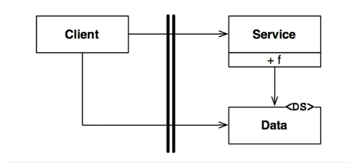
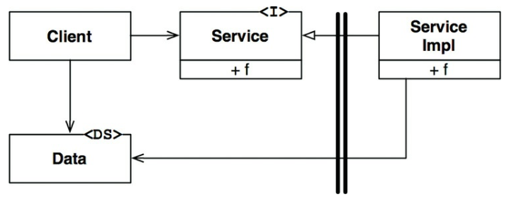
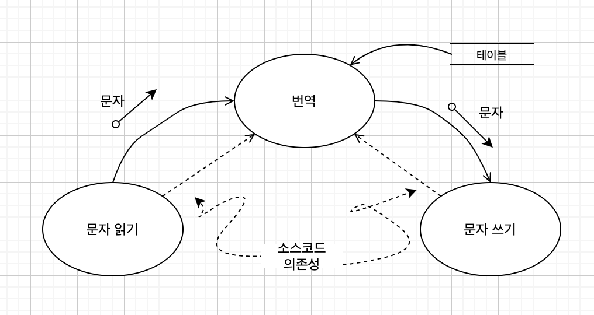
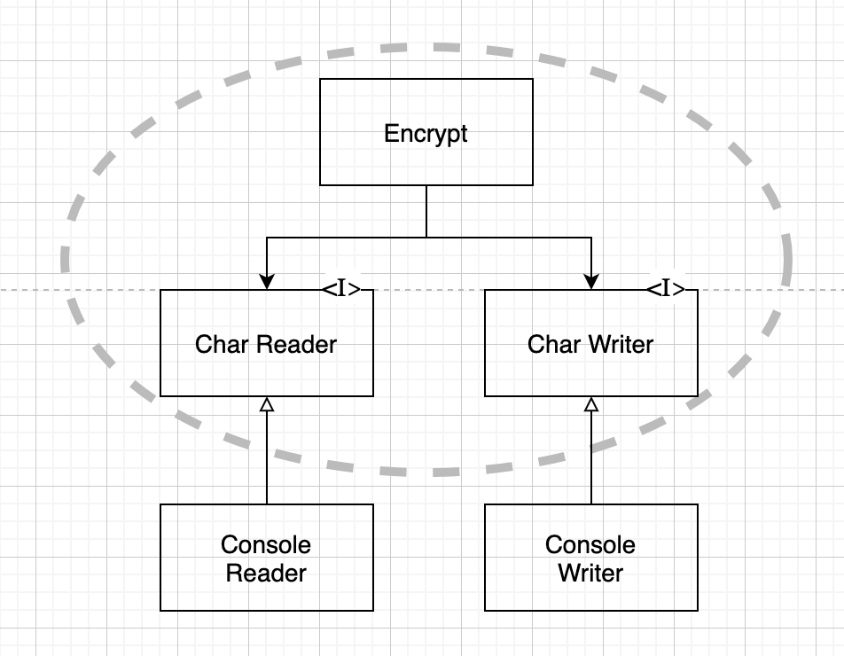

# 경계 해부학

- 저수준 클라이언트 -> 고수준 서비스
- 런타임 의존성과 컴파일타임 의존성 모두 같은 방향
- 즉, 저수준 컴포넌트 -> 고수준 컴포넌트
- 제어흐름 : 왼쪽 -> 오른쪽
- 호출되는 쪽에 데이터가 정의되어 있음

- 고수준 클라이언트 -> 저수준 서비스
- 동적 다형성을 사용하면 제어흐름과는 반대 방향으로 의존성을 역전시킬 수 있다.
- 런타임 의존성과 컴파일타임 의존성이 반대가 됨
- 제어 흐름 : 왼쪽 -> 오른쪽
- 의존성 : 오른쪽 -> 왼쪽
- 호출하는 쪽에 데이터가 정의되어 있음

# 정책과 수준

- 소프트웨어 시스템이란 정책을 기술한 것이다.
- 컴파일타임의 의존성
  - 자바 : import
  - C# : using
  - 루비 : require

- '수준(level)'을 엄밀하게 정의하자면 '입력과 출력까지의 거리'다.
- 시스템의 입력과 출력 모두로부터 멀리 위치할수록 정책의 수준은 높아진다.
- 번역 컴포넌트는 이 시스템에서 최고 수준의 컴포넌트이다.
- 데이터 흐름과 소스 코드 의존성이 항상 같은 방향을 가리키지는 않는다.
- 소스 코드 의존성은 그 수준에 따라 결합되어야하며, 데이터 흐름을 기준으로 결합되어서는 안 된다.

- 고수준 정책, 즉 입력과 출력에서부터 멀리 떨어진 정책은 저수준 정책에 비해 덜 빈번하게 변경되고, 보다 중요한 이유로 변경되는 경향이 있다.
- 저수준 정책, 즉 입력과 출력에 가까이 위치한 정책은 더 빈번하게 변경되며, 보다 긴급성을 요하며, 덜 중요한 이유로 변경되는 경향이 있다.

# 업무 규칙

- **핵심 업무 규칙** : 사업적으로 수익을 얻거나 비용을 줄일 수 있는 규칙 또는 절차다. -> 사업 자체에 핵심적
  - 예) 은행에서 대출에 N%의 이자를 부과하는 규칙
- 핵심 업무 규칙은 보통 데이터를 요구한다. -> **핵심 업무 데이터**
  - 예) 대출에는 대출 잔액, 이자율, 지급 일정이 필요하다.
- 핵심 규칙과 핵심 데이터는 본질적으로 결합되어 있기 때문에 객체로 만들 좋은 후보가 된다. 우리는 이러한 유형의 객체를 **엔티티**(Entity)라고 하겠다.

### 엔티티 (Entity)

- 컴퓨터 시스템 내부의 객체로서,
-
