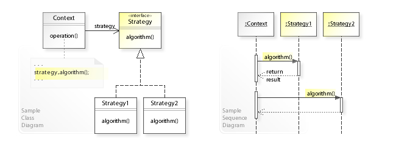

# Strategy Pattern (전략 패턴)

- 실행(런타임) 중에 알고리즘 *전략*을 선택하여 객체 동작을 실시간으로 바뀌도록 할 수 있게 하는 행위 디자인 *패턴* 이다.
- 특정한 계열의 알고리즘들을 정의하고
- 각 알고리즘을 캡슐화하며
- 이 알고리즘들을 해당 계열 안에서 상호 교체가 가능하게 만든다.

    <전략 디자인 패턴을 위한 샘플 UML 클래스와 시퀀스 다이어그램>

- 컨텍스트(Context) 란 콘텐츠(Contetns)를 담는 그 무엇인가를 뜻한며, 어떤 객체를 핸들링 하기 위한 접근 수단이다.
  즉, 물컵에 물이 담겨있으면 물은 콘텐츠가 되고, 물컵은 컨텍스트가 되며, 물을 핸들링 하기 위한 접근 수단이 된다.

### 사용 시기

- 전략 알고리즘의 여러 버전 또는 변형이 필요할 때 클래스화를 통해 관리
- 알고리즘 코드가 노출되어서는 안 되는 데이터에 엑세스 하거나 데이터를 활용할 때 (캡슐화)
- 알고리즘의 동작이 런타임에 실시간으로 교체 되어야 할때

### 주의점

- 알고리즘이 많아질수록 관리해야할 객체의 수가 늘어난다는 단점이 있다.
- 만일 어플리케이션 특성이 알고리즘이 많지 않고 자주 변경되지 않는다면, 새로운 클래스와 인터페이스를 만들어 프로그램을 복잡하게 만들 이유가 없다.
- 개발자는 적절한 전략을 선택하기 위해 전략 간의 차이점을 파악하고 있어야 한다.
